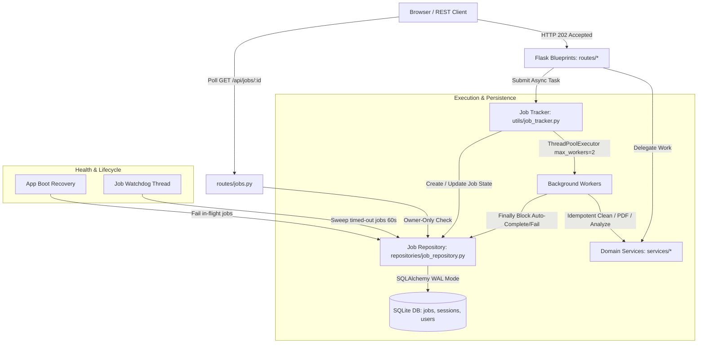

# Mercury - AI Data Cleaning MVP

Mercury is a Flask-based web application that provides intelligent data ingestion, schema analysis, and AI-driven data cleaning recommendations. It leverages an asynchronous processing architecture and integrates with OpenAI-compatible APIs (configured for Nvidia endpoints) to help users clean, transform, and understand their datasets, ultimately generating comprehensive PDF reports.

## Key Features
- **Data Ingestion:** Upload `.csv`, `.xls`, or `.xlsx` datasets.
- **Schema Analysis:** Automatically parses dataset structure, detects missing values, and evaluates unique value distributions.
- **AI-Assisted Cleaning:** Provides recommendations on dropping useless identifiers, imputing missing values, and formatting columns for downstream machine learning tasks.
- **Asynchronous Processing:** Long-running data processing jobs are handled safely in background threads, maintaining a responsive UI.
- **Interactive Chat Interface:** Refine and negotiate data cleaning steps dynamically with the AI via a chat interface.
- **PDF Reporting:** Generates downloadable reports summarizing the cleaning steps and outcomes.

## System Architecture & Background Jobs

Mercury uses a modular service-oriented architecture with decoupled Blueprints, persistent SQLite database models, and an asynchronous job execution framework backed by a bounded `ThreadPoolExecutor`:



### Background Job Lifecycle
1. **Dispatch (202 Accepted)**: Heavy operations (`/api/analyze`, `/api/sessions/<id>/trigger_process`, `/api/sessions/<id>/pdf`) return HTTP `202 Accepted` with a UUID `job_id`.
2. **Execution**: Submitted to a bounded `ThreadPoolExecutor(max_workers=2)` so heavy computations cannot exhaust server resources.
3. **Owner-Only Polling**: Clients query `GET /api/jobs/<job_id>`. Requests for other users' jobs return stealth `404 Not Found`.
4. **Crash Resiliency**:
   - **Startup Recovery**: On server restart, all queued or running jobs are immediately marked as `failed` with `"Interrupted by server restart"`.
   - **Watchdog Daemon**: A background thread periodically checks for jobs running past their `timeout_seconds` threshold and transitions them to `failed`.


### Prerequisites
- Python 3.9+
- An API Key compatible with the OpenAI spec (currently configured to point to Nvidia's endpoint).

### Installation
1. Install dependencies:
   ```bash
   pip install -r requirements.txt
   ```
### Environment Variables

Configure these settings in a `.env` file in the root directory or pass them via your deployment environment:

#### Required in Production
| Variable | Description |
|---|---|
| `SECRET_KEY` | **Mandatory** when `DEBUG=false`. Cryptographically secure secret key used for session cookie signing. The application **strictly refuses to start** in production if missing or set to an insecure placeholder (e.g. `changeme`, `secret`, `placeholder`). |

#### LLM Provider Configuration
| Variable | Default | Description |
|---|---|---|
| `LLM_PROVIDER` | `nvidia` | Default LLM provider (`nvidia`, `openai`, `anthropic`, `gemini`, `openrouter`, `ollama`). |
| `LLM_MODEL` | `meta/llama-3.3-70b-instruct` | Default LLM model identifier. |
| `NVIDIA_API_KEY` | — | API key for Nvidia endpoints (`https://integrate.api.nvidia.com/v1`). |
| `OPENAI_API_KEY` | — | API key for OpenAI official models (`gpt-4o`, etc.). |
| `ANTHROPIC_API_KEY` | — | API key for Anthropic Claude models. |
| `GEMINI_API_KEY` | — | API key for Google Gemini models. |
| `OPENROUTER_API_KEY` | — | API key for OpenRouter routing. |
| `OLLAMA_BASE_URL` | `http://localhost:11434` | Local Ollama base URL (allowed only when `DEBUG=true`). |

#### Upload & Shape Caps
| Variable | Default | Description |
|---|---|---|
| `MAX_CONTENT_LENGTH` | `16777216` (16MB) | Maximum HTTP upload payload (returns clean 413 JSON if exceeded). |
| `MAX_ROWS` | `200000` | Maximum rows allowed per dataset upload. |
| `MAX_COLS` | `500` | Maximum columns allowed per dataset upload. |
| `MAX_XLSX_SHEETS` | `10` | Maximum worksheets allowed in uploaded Excel workbooks. |
| `MAX_UNCOMPRESSED_BYTES` | `209715200` (200MB) | Uncompressed zip extraction cap to defend against decompression bombs. |

#### User Quotas & Rate Limits
| Variable | Default | Description |
|---|---|---|
| `MAX_SESSIONS_PER_USER` | `20` | Maximum active dataset sessions allowed per user. |
| `MAX_STORAGE_BYTES_PER_USER` | `524288000` (500MB) | Total disk storage allocated per authenticated user across uploads and outputs. |
| `RATELIMIT_STORAGE_URI` | `memory://` | Storage backend for Flask-Limiter (`memory://` for single-process, `redis://...` for multi-worker). |
| *Route Rate Limits* | Per-user | `/api/upload` (10/hr), `/api/sessions/<id>/chat` (60/hr), `/api/sessions/<id>/pdf` (10/hr). |

#### Lifecycle & Cleanup Sweeps
| Variable | Default | Description |
|---|---|---|
| `SESSION_TTL_SECONDS` | `86400` (24h) | Time-to-live since last access before a session and its associated files are purged. |
| `CLEANUP_INTERVAL_SECONDS` | `3600` (1h) | Frequency of the background daemon thread sweep. |

---

### Running the Application

#### Development
```bash
python app.py
```
Starts development server on `http://127.0.0.1:5000` with debug mode and logging redaction filter active.

#### Production Deployment
Never run the Flask development server (`flask run` or `python app.py`) in production. Use a production WSGI server:

1. **Linux / Containerized (Gunicorn):**
   ```bash
   # 4 worker processes bound to localhost (terminate TLS with Nginx or Caddy)
   gunicorn -w 4 -b 127.0.0.1:5000 --access-logfile - --error-logfile - app:app
   ```
   *Note:* If scaling across multiple Gunicorn workers, configure `RATELIMIT_STORAGE_URI=redis://localhost:6379/0` to share rate-limit counters.

2. **Windows Server (Waitress):**
   ```bash
   waitress-serve --listen=127.0.0.1:5000 app:app
   ```

3. **Reverse Proxy (Nginx Recommendation):**
   Always run behind a reverse proxy terminating HTTPS, forwarding headers (`X-Forwarded-For`, `X-Forwarded-Proto`), and enforcing HTTP/2 or HTTP/3. Example configuration:
   ```nginx
   server {
       listen 443 ssl http2;
       server_name mercury.example.com;

       ssl_certificate /etc/letsencrypt/live/mercury.example.com/fullchain.pem;
       ssl_certificate_key /etc/letsencrypt/live/mercury.example.com/privkey.pem;

       client_max_body_size 16M;

       location / {
           proxy_pass http://127.0.0.1:5000;
           proxy_set_header Host $host;
           proxy_set_header X-Real-IP $remote_addr;
           proxy_set_header X-Forwarded-For $proxy_add_x_forwarded_for;
           proxy_set_header X-Forwarded-Proto $scheme;
       }
   }
   ```


## Testing
To test the platform's cleaning capabilities, you can generate a sample dirty dataset by running:
```bash
python generate_test_data.py
```
This will produce a `test_dirty_data.xlsx` file that you can upload to the application.

## Developer & Agent Documentation
This repository is configured for autonomous multi-agent development. If you are a contributing agent or developer, you **MUST** review the following documentation before making code changes:

- **[AGENTS.md](./AGENTS.md):** Governance, token constraints, and execution safety rules.
- **[ARCHITECTURE.md](./ARCHITECTURE.md):** High-level system overview and directory map.
- **[KNOWLEDGE_GRAPH.md](./KNOWLEDGE_GRAPH.md):** Complete structural index of modules, functions, and interfaces. Read this file instead of scanning full source files.
- **[COMMIT.md](./COMMIT.md):** Guidelines for Conventional Commits and branch naming.
- **[CHANGELOG.md](./CHANGELOG.md) & [COMMIT_LOG.md](./COMMIT_LOG.md):** Mandatory tracking logs for codebase changes.
